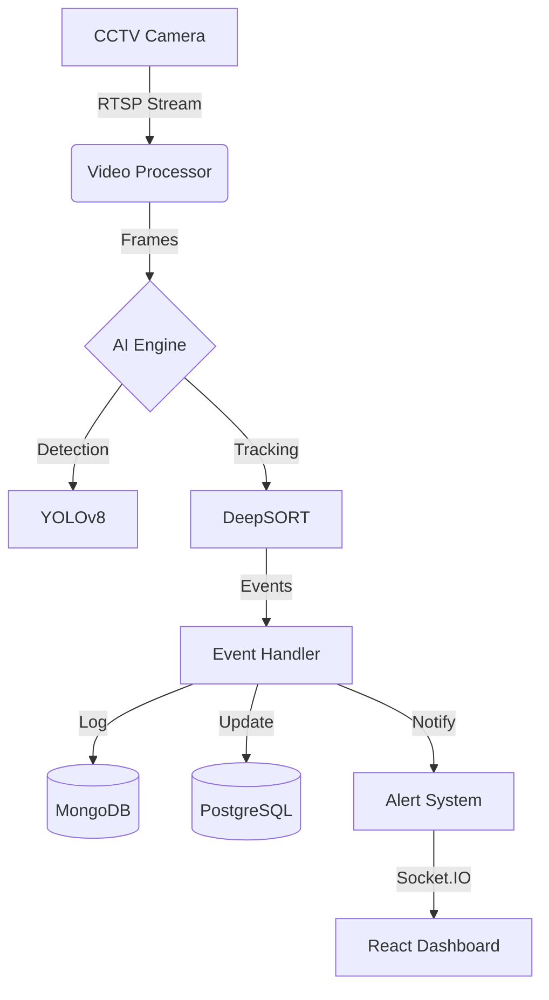

# Smart Shelf Intelligence System (SSIS)


**An enterprise-grade AI system for real-time retail inventory management, anomaly detection, and shelf monitoring.**

---

## 📖 Table of Contents
- [Project Overview](#-project-overview)
- [Key Features](#-key-features)
- [System Architecture](#-system-architecture)
- [Tech Stack](#-tech-stack)
- [🚀 Quick Start](#-quick-start)
- [🛠️ Manual Installation](#-manual-installation)
- [Project Structure](#-project-structure)
- [Roadmap](#-roadmap)
- [Contributing](#-contributing)
- [License](#-license)

---

## 🎯 Project Overview

The **Smart Shelf Intelligence System (SSIS)** uses advanced Computer Vision to monitor supermarket shelves via CCTV. It automates inventory tracking, detects misplaced items in real-time, and provides actionable insights to store managers, reducing manual labor costs and preventing stockouts.

### Why SSIS?
- **Automated Monitoring:** No more manual counting.
- **Real-time Alerts:** Instant notifications for low stock or theft.
- **Data-Driven:** Analytics on picking patterns and customer behavior.

---

## ✨ Key Features

- **Store-Item Detection:** Real-time object detection using **YOLOv8**.
- **Multi-Object Tracking:** Accurate tracking of moved items via **DeepSORT**.
- **Event Recognition:**
  - 🟢 **Pick:** Customer takes an item.
  - 🔵 **Return:** Customer puts an item back.
  - 🔴 **Misplacement:** Item placed on the wrong shelf.
- **Smart Alerts:** Notifications via **WebSocket**, Email, or WhatsApp.
- **Interactive Dashboard:** Modern **React** UI for live monitoring and analytics.
- **Scalable Backend:** Microservices architecture with **FastAPI** and **Docker**.

---

## 📊 System Architecture



---

## 🛠 Tech Stack

| Component | Technologies |
|-----------|--------------|
| **AI / CV** | YOLOv8, OpenCV, DeepSORT, PyTorch |
| **Backend** | Python 3.11, FastAPI, Uvicorn, SQLAlchemy |
| **Frontend** | React, Vite, TailwindCSS, Recharts |
| **Database** | PostgreSQL (Inventory), MongoDB (Events), Redis (Cache) |
| **DevOps** | Docker, Docker Compose, Nginx |

---

## 🚀 Quick Start

### Prerequisites
- [Docker Desktop](https://www.docker.com/products/docker-desktop/) installed.

### Option 1: One-Click Run (Windows)
Simply double-click the `run_with_docker.bat` script in the root directory.

### Option 2: Docker Compose (All Platforms)
1. **Clone the repository:**
   ```bash
   git clone https://github.com/yourusername/smart-shelf-intelligence.git
   cd smart-shelf-intelligence
   ```

2. **Start the system:**
   ```bash
   docker-compose up --build -d
   ```

3. **Access the application:**
   - **Dashboard:** [http://localhost:3000](http://localhost:3000)
   - **API Documentation:** [http://localhost:8000/docs](http://localhost:8000/docs)

---

## 🔧 Manual Installation

If you prefer running without Docker:

### 1. Backend Setup
```bash
cd backend
python -m venv venv
# Windows: venv\Scripts\activate | Mac/Linux: source venv/bin/activate
pip install -r requirements.txt
# Ensure PostgreSQL and MongoDB are running locally
uvicorn app.main:app --reload
```

### 2. Frontend Setup
```bash
cd frontend
npm install
npm run dev
```

---

## 📁 Project Structure

```bash
smart-shelf-intelligence/
├── ai_engine/          # Computer Vision logic (YOLO, DeepSORT)
├── backend/            # FastAPI server & business logic
├── frontend/           # React dashboard application
├── database/           # SQL/NoSQL initialization scripts
├── docker-compose.yml  # Container orchestration
└── run_with_docker.bat # Windows startup script
```

---

## 🗺 Roadmap

- [x] **Phase 1:** Core Object Detection & Tracking (MVP)
- [x] **Phase 2:** Event Detection (Pick/Return)
- [x] **Phase 3:** Real-time Dashboard & Alerts
- [x] **Phase 4:** ML Analytics (Predictive Restocking)
- [x] **Phase 5:** Multi-Camera Support & 3D Tracking
- [x] **Phase 6:** Cloud Deployment (AWS/Azure)

---

## 🤝 Contributing

Contributions are welcome! Please follow these steps:
1. Fork the repository.
2. Create your feature branch (`git checkout -b feature/AmazingFeature`).
3. Commit your changes (`git commit -m 'Add some AmazingFeature'`).
4. Push to the branch (`git push origin feature/AmazingFeature`).
5. Open a Pull Request.

---

## 📄 License

Distributed under the MIT License. See `LICENSE` for more information.
